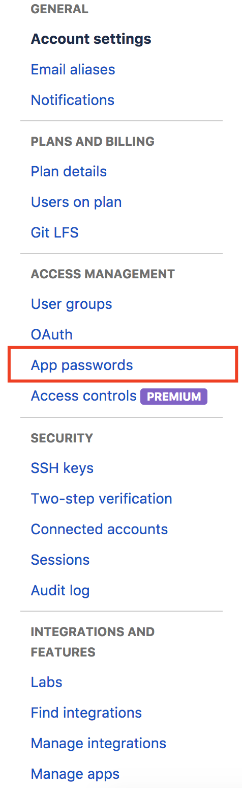
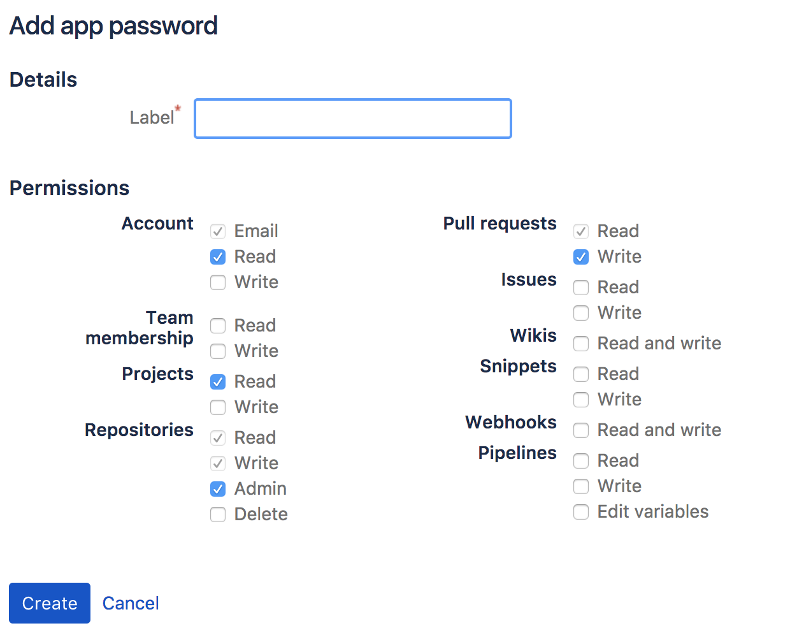

**Bitbucket Cloud API**

Java Library to acces the Bitbucket Cloud API.
<br/>
https://developer.atlassian.com/bitbucket/api/2/reference/resource/repositories

Supported API Calls
- Get User
- Get Repositories
- Get Default Users
- Create Pull Request

**Authentication**

_Username_

This is the name chosen when you created your account. (It can be found in the Bitbucket Settings under Account Settings)

_App Token_

This is a token you need to generate in your Bitbucket Settings. Go to App Passwords (under Acces Management). You can create a new App Password. This will be used instead of your 2 Step Verification.





The best option to save your Username and App Token is to save them in your System Environment (for Mac You can use [EnvPane](https://github.com/hschmidt/EnvPane) or just set them with commandline.)

**Get User**

[Documentation](https://developer.atlassian.com/bitbucket/api/2/reference/resource/user)

```
final Response<BitbucketUser> response = new Bitbucket(USERNAME, APP_TOKEN).getApi()
                             .getUser()
                             .execute();
```

**Get Repositories**

[Documentation](https://developer.atlassian.com/bitbucket/api/2/reference/resource/repositories/%7Busername%7D)

```
final Response<PagedList<BitbucketRepository>> response = new Bitbucket(USERNAME, APP_TOKEN).getApi()
                            .getRepositories(user,PropertyCompare.eq("name", repoSlug))
                            .execute();
```

**Get Default Users**

[Documentation](https://developer.atlassian.com/bitbucket/api/2/reference/resource/repositories/%7Busername%7D/%7Brepo_slug%7D/default-reviewers)

```
final Response<PagedList<BitbucketRepository>> response = new Bitbucket(USERNAME, APP_TOKEN).getApi()
                            .getDefaultReviewers(user, repoSlug)
                            .execute();
```

**Create Pull Request**

[Documentation](https://developer.atlassian.com/bitbucket/api/2/reference/resource/repositories/%7Busername%7D/%7Brepo_slug%7D/pullrequests#post)

Without reviewers:
```
final String title = "Title of your PR";
final String description = "Description of your PR";

final Destination source = new Destination("branch-name-you-want-to-merge");
final Destination destination = new Destination("branch-name-where-you-want-to-merge-to");

final PullRequest pullRequest = new PullRequest(title, description, source, destination, null);

final Response<PullRequest> response = mBitbucket.getApi()
                .postPullRequest(user, repoSlug, pullRequest)
                .execute();
```

With reviewers (your own username may not be included):
```
final Response<PagedList<DefaultReviewer>> responseDefaultReviewers = mBitbucket.getApi()
                .getDefaultReviewers(user, repoSlug)
                .execute();
                
final PagedList<DefaultReviewer> defaultReviewers = responseDefaultReviewers.body();

final List<DefaultReviewer> filteredList = defaultReviewers.getValues()
                .stream()
                .filter(r -> !r.getUsername().equals(USERNAME))
                .collect(Collectors.toList());

final String title = "Title of your PR";
final String description = "Description of your PR";

final Destination source = new Destination("branch-name-you-want-to-merge");
final Destination destination = new Destination("branch-name-where-you-want-to-merge-to");

final PullRequest pullRequest = new PullRequest(title, description, source, destination, filteredList);

final Response<PullRequest> response = mBitbucket.getApi()
                .postPullRequest(user, repoSlug, pullRequest)
                .execute();
```


With hardcoded reviewer:
```
final List<DefaultReviewer> reviewers = new ArrayList();
reviewers.add(new DefaultReviewer("username-of-the-reviewer"));

final String title = "Title of your PR";
final String description = "Description of your PR";

final Destination source = new Destination("branch-name-you-want-to-merge");
final Destination destination = new Destination("branch-name-where-you-want-to-merge-to");

final PullRequest pullRequest = new PullRequest(title, description, source, destination, reviewers);

final Response<PullRequest> response = mBitbucket.getApi()
                .postPullRequest(user, repoSlug, pullRequest)
                .execute();
```